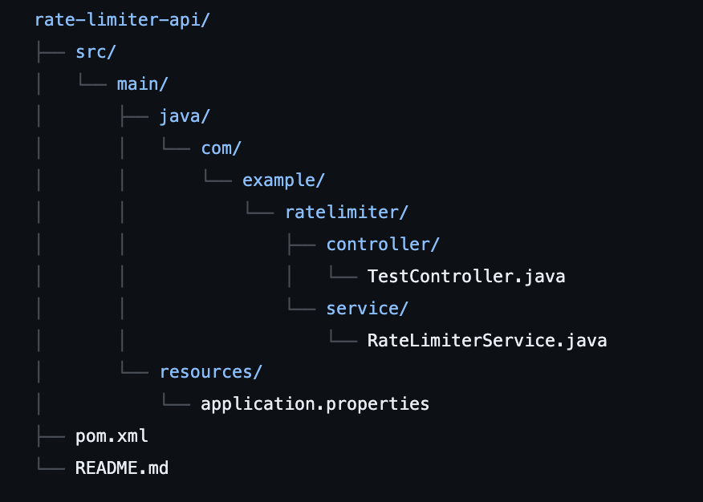

#  Rate Limiter API

A backend service built using Spring Boot that limits API requests per user using a sliding window algorithm.

---

##  Problem

APIs can be abused by sending too many requests in a short time.
This project prevents that by enforcing request limits per user.

---

##  Features

* 1. Per-user rate limiting
* 2. Sliding window algorithm
* 3. Thread-safe implementation
* 4. REST API endpoint

---

##  Tech Stack

- **Language:** Java  
- **Framework:** Spring Boot  
- **Build Tool:** Maven  
- **Concurrency:** ConcurrentHashMap, synchronized collections  
- **Architecture:** RESTful API  

##  API Endpoint

GET /api/request?userId=<userId>

### Example

http://localhost:8080/api/request?userId=gaurika

---

##  Rate Limiting Logic

* Max **3 requests per 10 seconds**
* Further requests are blocked

---

##  How It Works

User Request → Check timestamps → Remove old requests → Check limit → Allow / Block

---
##  System Flow

  

##  How to Run

git clone https://github.com/Gaurika29062004/rate-limiter-api.git
cd rate-limiter-api
./mvnw spring-boot:run

---
## Project Structure

 

##  Future Improvements

* Redis-based distributed rate limiting
* Configurable limits
* Authentication support

---

##  Author

Gaurika Gupta
